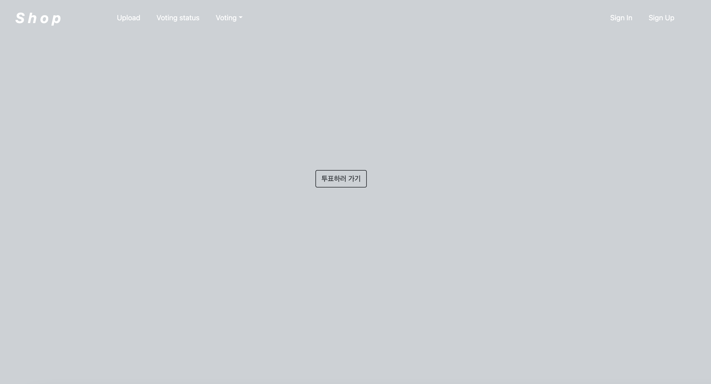

# 🗳 Vote Project (React, Firebase)

개인프로젝트
## Getting Started with Create React App

This project was bootstrapped with [Create React App](https://github.com/facebook/create-react-app).

## Available Scripts

In the project directory, you can run:

### `npm start`

Runs the app in the development mode.\
Open [http://localhost:3000](http://localhost:3000) to view it in the browser.

## Development Configuration

# Feature

지역을 기반으로 한 상권 투표 시스템 서비스를 구현하였습니다. (현재 진행중)

## 기술적 요소

- firebase의 getAuth로 해당지역의 사람들만 상호명과 이미지를 업로드 할 수 있도록 함
- react-hook-form을 사용해 로그인, 회원가입, 업로드 페이지 내 form의 유효성을 register, watch, formState를 사용해 사용자가 입력할 때마다 추적해 검사
- 투표 button 누르면 메인화면 위에 modal창 띄워지도록 구현
- useEffect를 통해 컴포넌트 로드 때 딱 한번만 동작하도록 구현(컴포넌트 라이프사이클)
- setTimeout 사용해 일정시간 후에 에러코드 실행 되도록 함
- createUserWithEmailAndPassword 메소드를 사용해 firebase에서 이메일과 비밀번호로 유저를 생성
- UseRef를 이용해 Password와 Password Confirm 일치 여부 구현
- 유니크한 값 가지기 위해 md5 모듈 이용
- 유저 정보를 redux로 상태관리
- firebase 연동해 user Model과 Schema 구축
- react-router-dom을 사용해 페이지간 이동을 구현

## 기능적 요소

- 회원가입, 로그인/로그아웃
- 새 상호명 등록, 이미지 첨부
- 투표